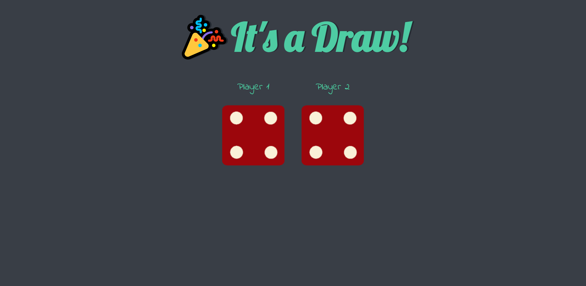

## Overview

### The Project

The aim of this project was to create a random number generator that displayed the generated numbers on two die on the screen followed by a text change to 
announce the winner. 

## Screenshot

### Links

- Live Site URL: https://aidenm99.github.io/Dicee-Game/

### Built with

-HTML, CSS, JavaScript

### What I learned

This project was useful in helping me come to grips with some of the very basic concepts in JavaScript such as generating and randomising numbers,
manipulating the DOM and changing the HTML of elements.
